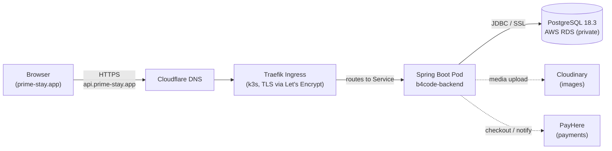

# B4Code Backend

**The API powering [PrimeStay](https://prime-stay.app) — a hospitality platform for property
search & booking, in-room QR-code F&B ordering, and full-service property management.**

Built with Spring Boot 3 on Java 21. Live in production on AWS, serving guests, property
owners, hotel staff, and platform admins from a single, role-aware backend.

[](https://openjdk.org/projects/jdk/21/)
[](https://spring.io/projects/spring-boot)
[](https://www.postgresql.org/)
[](https://k3s.io/)
[](https://www.docker.com/)
[](https://api.prime-stay.app)

**Live API:** [`https://api.prime-stay.app`](https://api.prime-stay.app) &nbsp;·&nbsp;
**Frontend:** [`https://prime-stay.app`](https://prime-stay.app) &nbsp;·&nbsp;
**API docs:** [`/swagger-ui/index.html`](https://api.prime-stay.app/swagger-ui/index.html)

---

## Contents

- [Overview](#overview)
- [Features by Role](#features-by-role)
- [Tech Stack](#tech-stack)
- [Architecture](#architecture)
- [Project Structure](#project-structure)
- [Getting Started](#getting-started)
- [API Documentation](#api-documentation)
- [Testing](#testing)
- [Deployment](#deployment)
- [Security](#security)
- [Contributing](#contributing)

---

## Overview

B4Code is the backend for **PrimeStay**, a hospitality platform that connects guests,
property owners, on-site staff, and platform administrators around a shared set of
properties, bookings, and in-stay services. It is a single Spring Boot application —
**339 Java files**, **49 REST controllers**, **43 JPA entities**, and **191 documented API
paths** — organised around four user roles and backed by a 6-schema PostgreSQL database.

The headline feature is **QR-code-based in-room food & beverage ordering**: a guest scans a
code at their table or in their room, browses the property's menu, places an order, and
watches its status update in real time (STOMP over WebSocket, with SSE as a fallback
channel) as kitchen staff process it.

## Features by Role

| Role | Capabilities |
|---|---|
| **Guest** | Search & browse properties, book rooms, scan in-room QR codes, order from the F&B menu, message staff, leave reviews, receive real-time order/booking updates |
| **Property Owner** | List & manage properties, room types, rates and availability, view reservations, manage staff accounts, review payouts and finance, respond to reviews |
| **Staff** | Manage menus and menu items, process incoming F&B orders end-to-end, handle guest messages, view property-level analytics and reservations |
| **Admin / Super Admin** | Platform-wide user management, review moderation, audit logs, dispute handling, analytics dashboards, platform configuration |

## Tech Stack

| Layer | Technology |
|---|---|
| Language / Runtime | Java 21 LTS |
| Framework | Spring Boot 3.2.4 (Web, Security, Data JPA, WebSocket, Mail) |
| Build | Maven |
| Database | PostgreSQL 18.3 (AWS RDS, private subnet, no public access) |
| Auth | Stateless JWT (`jjwt` 0.12.5) + Spring Security |
| Real-time | WebSocket / STOMP, Server-Sent Events (SSE) |
| API Docs | springdoc-openapi (Swagger UI) |
| Media Storage | Cloudinary |
| Payments | PayHere (Sri Lanka) |
| Email | Gmail SMTP |
| Containerisation | Docker (multi-stage, non-root runtime user) |
| Orchestration | k3s (lightweight Kubernetes) on a single EC2 host |
| Ingress / TLS | Traefik + Let's Encrypt (cert-manager, auto-renewing) |
| DNS | Cloudflare |
| CI/CD | GitHub Actions (test → CodeQL → build → Trivy → deploy) |
| Testing | JUnit 5 + Mockito, in-memory H2 |

> **Note on Redis:** `spring-boot-starter-data-redis` and `spring-session-data-redis` are
> present on the classpath, but **no Redis instance runs in production**. `application-prod.yml`
> explicitly sets `spring.session.store-type: none` because auth is fully stateless (JWT) and
> nothing reads `HttpSession`. A handful of `@Cacheable` annotations also exist in the codebase
> but are currently inert — there is no `@EnableCaching` configuration, so no caching is active.
> These are listed here for transparency rather than as claims about runtime behaviour.

## Architecture

Request flow from a browser to the database, as it runs in production today:



The application itself runs a **single, self-contained Spring Boot process** — the
`kubernetes/` Deployment/Service definitions in this repo describe how that process is
packaged and exposed, but there is no service mesh or separate backend-for-frontend layer;
all 49 controllers live in one deployable artifact.

## Project Structure

The codebase is organised as a layered application under a single package, with
role-oriented naming (`Guest*`, `Owner*`, `Staff*`, `Admin*`) used at the controller/service
level rather than as separate module directories:

```text
b4code-backend/
├── Dockerfile                        # Multi-stage build: Maven build → JRE-alpine runtime
├── kubernetes/
│   └── helm/                         # Deployment/Service manifests (Helm chart)
├── .github/workflows/
│   ├── ci.yml                        # Build, test, CodeQL SAST on every PR/push
│   └── deploy.yml                    # Test → build → push to ECR → Trivy → deploy to k3s
├── src/main/java/com/b4code/backend/
│   ├── rest/                         # 🎯 REST controllers (49 total)
│   │   └── staff/                    # Staff-specific controllers (analytics, reservations…)
│   ├── service/                      # Business logic
│   │   ├── impl/                     # Service implementations
│   │   └── staff/                    # Staff-specific services
│   ├── repository/ & dao/            # Spring Data JPA repositories / data access
│   ├── models/                       # 🗄️ JPA entities (43) + enums + messaging DTOs
│   ├── dto/                          # Request/response payloads (owner/, staff/ subsets)
│   ├── common/
│   │   ├── config/                   # SecurityConfig, OpenApiConfig, DB migration runner
│   │   └── security/                 # JwtAuthFilter, JwtUtil, AttributeEncryptor (AES)
│   ├── config/                       # WebSocketConfig, scheduled cleanup, schema logging
│   ├── infrastructure/storage/       # Cloudinary integration
│   ├── exception/ & exceptions/      # Domain exceptions + global exception handler
│   └── BackendApplication.java
└── src/main/resources/
    ├── application.yml               # Shared defaults, active profile switch
    ├── application-dev.yml           # Local development profile
    ├── application-prod.yml          # Production profile (env-var driven)
    └── schema.sql                    # Creates the app_auth/guest/owner/staff/admin schemas
```

Data is partitioned across **6 PostgreSQL schemas** — `app_auth`, `guest`, `owner`, `staff`,
`admin`, and `public` — totalling **99 tables**, with Hibernate managing table-level DDL
(`ddl-auto: update`) on top of the schemas created in `schema.sql`.

## Getting Started

### Prerequisites

- Java 21 (Temurin recommended)
- Maven (or use the included `mvnw`/system Maven)
- A PostgreSQL instance reachable from your machine (local Docker, a cloud dev DB, etc.)

### Clone

```bash
git clone <repository-url>
cd b4code-backend
```

### Configure environment variables

The app reads a local `.env` file automatically via Spring's config import
(`spring.config.import: optional:file:.env[.properties]`) — create one in the project root:

<details>
<summary><strong>Environment variables reference</strong></summary>

| Variable | Purpose | Required |
|---|---|---|
| `DB_HOST`, `DB_PORT`, `DB_NAME` | PostgreSQL connection target | Yes |
| `DB_USER`, `DB_PASSWORD` | PostgreSQL credentials | Yes |
| `DB_SSLMODE` | SSL mode for the JDBC URL (defaults to `require` in prod) | No |
| `JWT_SECRET` | Signing secret for issued JWTs | Yes |
| `APP_FRONTEND_URL` | Public frontend URL used in emailed links & QR targets | No (has default) |
| `APP_CORS_ALLOWED_ORIGINS` | Comma-separated list of allowed browser origins | No (has default) |
| `MAIL_USERNAME`, `MAIL_PASSWORD` | Gmail SMTP credentials for outgoing email | Yes (for email features) |
| `PAYHERE_MERCHANT_ID`, `PAYHERE_SECRET` | PayHere merchant credentials | Yes (for payments) |
| `PAYHERE_SANDBOX` | `true` to use PayHere's sandbox checkout | No |
| `CLOUDINARY_CLOUD_NAME`, `CLOUDINARY_API_KEY`, `CLOUDINARY_API_SECRET` | Cloudinary credentials | Yes (for image upload) |
| `SPRING_PROFILES_ACTIVE` | `dev` (default) or `prod` | No |

</details>

### Run locally

```bash
mvn clean spring-boot:run
```

The API starts on `http://localhost:8080`. The `dev` profile is active by default and
pre-configures a CORS allow-list for common local frontend ports
(`3000`, `3001`, `3002`, `3003`, `5173`).

### Run the tests

```bash
mvn test
```

The suite (**45 tests**, JUnit 5 + Mockito) runs entirely against an in-memory H2 database —
no external PostgreSQL instance or secrets are required, and it completes in roughly 46
seconds. This is also exactly how CI runs it before every deploy.

## API Documentation

Interactive, always-current API documentation is generated by springdoc-openapi:

- **Local:** `http://localhost:8080/swagger-ui/index.html`
- **Production:** [`https://api.prime-stay.app/swagger-ui/index.html`](https://api.prime-stay.app/swagger-ui/index.html)

<details>
<summary><strong>Controller map (49 controllers, grouped by area)</strong></summary>

| Area | Controllers |
|---|---|
| Auth & Users | `AuthController`, `UserController`, `AdminUserController` |
| Public / Search | `PublicPropertyController`, `SearchController` |
| Property & Rooms (Owner) | `OwnerPropertyController`, `OwnerRoomTypeController`, `OwnerRateController`, `OwnerAvailabilityController`, `OwnerReservationController`, `OwnerSettingsController`, `OwnerStaffController`, `OwnerDashboardController`, `PropertyController`, `RoomTypeController` |
| Property & Rooms (Staff) | `staff/StaffPropertyController`, `staff/StaffReservationController` |
| Bookings & Payments | `BookingController`, `PaymentController`, `FinanceController` |
| Menu & F&B | `MenuController`, `MenuCategoryController`, `MenuItemController`, `GuestMenuController` |
| Ordering & QR | `QRCodeController`, `GuestOrderController`, `StaffOrderController` |
| Messaging | `GuestMessageController`, `StaffMessageController`, `GuestOrderMessageController`, `StaffOrderMessageController`, `AutoReplyController` |
| Reviews & Moderation | `ReviewController`, `ItemReviewController`, `staff/StaffReviewController`, `ModerationController` |
| Notifications | `NotificationController`, `AdminNotificationController`, `StaffNotificationController`, `OrderNotificationController` |
| Analytics & Dashboards | `AnalyticsController`, `staff/StaffAnalyticsController`, `DashboardController` |
| Admin & Audit | `AuditLogController`, `SettingsController` |
| Media | `infrastructure/storage/ImageUploadController` |
| Diagnostics (non-prod) | `TestController`, `TestCloudinaryController` |

</details>

## Testing

- **Framework:** JUnit 5 + Mockito, plus `spring-security-test` for security-context assertions.
- **Database:** In-memory H2 — the test suite has no dependency on an external PostgreSQL
  instance, so it runs identically on a laptop and in CI.
- **Scale:** 45 tests, completing in roughly 46 seconds.
- **CI enforcement:** The `test` job in `.github/workflows/deploy.yml` must pass before an
  image is ever built or pushed; `ci.yml` runs the same suite on every pull request.

```bash
mvn test                          # run the full suite
mvn test -Dtest=SomeSpecificTest  # run a single test class
```

## Deployment

**B4Code Backend is live in production**, serving the PrimeStay platform at
`api.prime-stay.app`.

### Infrastructure

| Component | Detail |
|---|---|
| Compute | AWS EC2, `c7i-flex.large` (2 vCPU / 4 GiB), Ubuntu |
| Orchestration | k3s (lightweight Kubernetes) |
| Database | AWS RDS PostgreSQL 18.3, private subnet — no public internet access |
| Container registry | AWS ECR |
| Ingress / TLS | Traefik, with cert-manager issuing and auto-renewing Let's Encrypt certificates |
| DNS | Cloudflare |
| Health checks | TCP startup, readiness, and liveness probes (no Actuator dependency in this project) |

### CI/CD pipeline

Every push to `main` runs through `.github/workflows/deploy.yml`:

```text
push to main
  │
  ├─ test              mvn test (H2, no external DB needed)
  │
  ├─ build-and-push     AWS auth via GitHub OIDC (no stored AWS keys)
  │                     → docker build → push to ECR (tagged by commit SHA + latest)
  │                     → Trivy scan for CRITICAL/HIGH vulnerabilities
  │
  └─ deploy             self-hosted runner: kubectl set image → kubectl rollout status
```

- **`ci.yml`** additionally runs CodeQL static analysis (SAST) on every pull request and
  push to `main`/`develop`/`dev`.
- **GitHub OIDC** is used to authenticate to AWS for the ECR push — the workflow assumes an
  IAM role via a short-lived OIDC token, so **no long-lived AWS access keys are stored as
  GitHub secrets**.
- The self-hosted deploy runner authenticates to the cluster as a scoped `deploy-sa`
  Kubernetes ServiceAccount that can patch Deployments in the `default` namespace only — it
  cannot read Secrets, delete workloads, or touch `kube-system`.

### Container image

The `Dockerfile` uses a multi-stage build:

1. `maven:3.9.6-eclipse-temurin-21-alpine` compiles the application.
2. The runtime stage copies only the built JAR onto `eclipse-temurin:21-jre-alpine` and
   runs it as a **non-root user** (`b4user:b4group`).

## Security

- **Stateless authentication:** JWT-based auth (`jjwt` 0.12.5) with
  `SessionCreationPolicy.STATELESS` — no server-side sessions are created or relied upon.
- **Password hashing:** BCrypt.
- **Authorisation:** Method-level access control via `@PreAuthorize`, used across the
  service layer to enforce role boundaries (Guest / Owner / Staff / Admin / Super Admin).
- **CORS:** A single allow-list, `app.cors.allowed-origins`, drives CORS for the whole
  application via `SecurityConfig`; there are no per-controller `@CrossOrigin` overrides.
- **Column-level encryption:** A custom JPA `AttributeConverter`
  (`AttributeEncryptor`) transparently encrypts selected sensitive entity fields at rest.
- **Database isolation:** RDS PostgreSQL sits in a private subnet with no public access;
  only the application pod can reach it.
- **Supply chain:** CodeQL SAST on every PR/push, and every container image is scanned with
  Trivy for critical/high vulnerabilities before it can be deployed.
- **Least-privilege deploys:** GitHub OIDC (no static AWS keys) plus a scoped Kubernetes
  `deploy-sa` ServiceAccount, as described above.

## Contributing

- **Branches:** CI runs against `main`, `develop`, and `dev`. Open pull requests against the
  appropriate branch for the change you're making; `main` is the production branch that
  triggers deployment on every push.
- **Before opening a PR:**

  ```bash
  mvn clean package   # confirm the build passes
  mvn test            # confirm the full test suite passes
  ```

- All pull requests run the CI workflow (build, test, CodeQL) automatically — please make
  sure it's green before requesting review.
